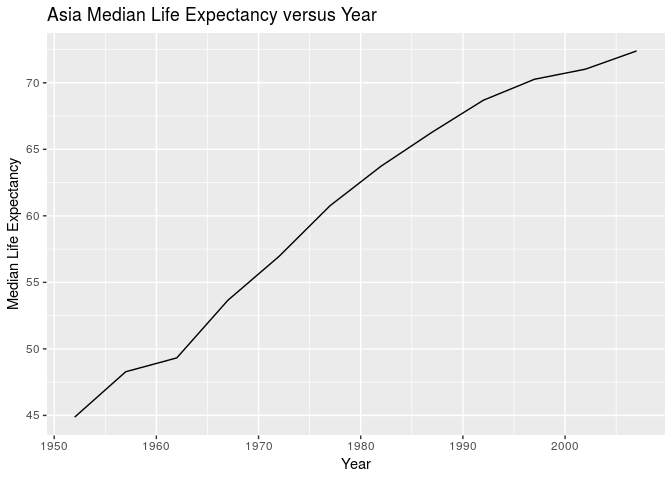

Gapminder-Exploration
================

``` r
options(warn = -1)
suppressPackageStartupMessages(library(tidyverse))
```

    ## Note: the specification for S3 class "difftime" in package 'lubridate' seems equivalent to one from package 'hms': not turning on duplicate class definitions for this class.

``` r
suppressPackageStartupMessages(library(gapminder))
```

R Markdown
----------

``` r
library(gapminder)
library(tidyverse)
```

Data Reshaping Task
-------------------

For the reshaping task, I chose activity number 3. In addition, I chose to compute the median life expectancy for each combination of continent and year. To reformat the data with columns for each of the continents, I used the the spread function.

``` r
df <- gapminder %>%
  group_by(continent, year) %>%
  summarize(medLifeExp = median(lifeExp)) %>%
  spread(key = "continent", value = "medLifeExp") 
knitr::kable(df, 'markdown') # print table
```

|  year|   Africa|  Americas|    Asia|   Europe|  Oceania|
|-----:|--------:|---------:|-------:|--------:|--------:|
|  1952|  38.8330|    54.745|  44.869|  65.9000|  69.2550|
|  1957|  40.5925|    56.074|  48.284|  67.6500|  70.2950|
|  1962|  42.6305|    58.299|  49.325|  69.5250|  71.0850|
|  1967|  44.6985|    60.523|  53.655|  70.6100|  71.3100|
|  1972|  47.0315|    63.441|  56.950|  70.8850|  71.9100|
|  1977|  49.2725|    66.353|  60.765|  72.3350|  72.8550|
|  1982|  50.7560|    67.405|  63.739|  73.4900|  74.2900|
|  1987|  51.6395|    69.498|  66.295|  74.8150|  75.3200|
|  1992|  52.4290|    69.862|  68.690|  75.4510|  76.9450|
|  1997|  52.7590|    72.146|  70.265|  76.1160|  78.1900|
|  2002|  51.2355|    72.047|  71.028|  77.5365|  79.7400|
|  2007|  52.9265|    72.899|  72.396|  78.6085|  80.7195|

``` r
ggplot(df, aes(year, Asia)) + 
    geom_line() +
    ggtitle("Asia Median Life Expectancy versus Year") + 
    xlab("Year") + 
    ylab("Median Life Expectancy")
```



A very simple task with this new data format is the ability to plot median life expectancy for some given continent versus year. Each continent is now treated as a quantitative variable, so we can use, for example, a line plot or scatterplot. As an example, I choose to plot the median life expectancy versus year for Asia.

Join Task
---------
